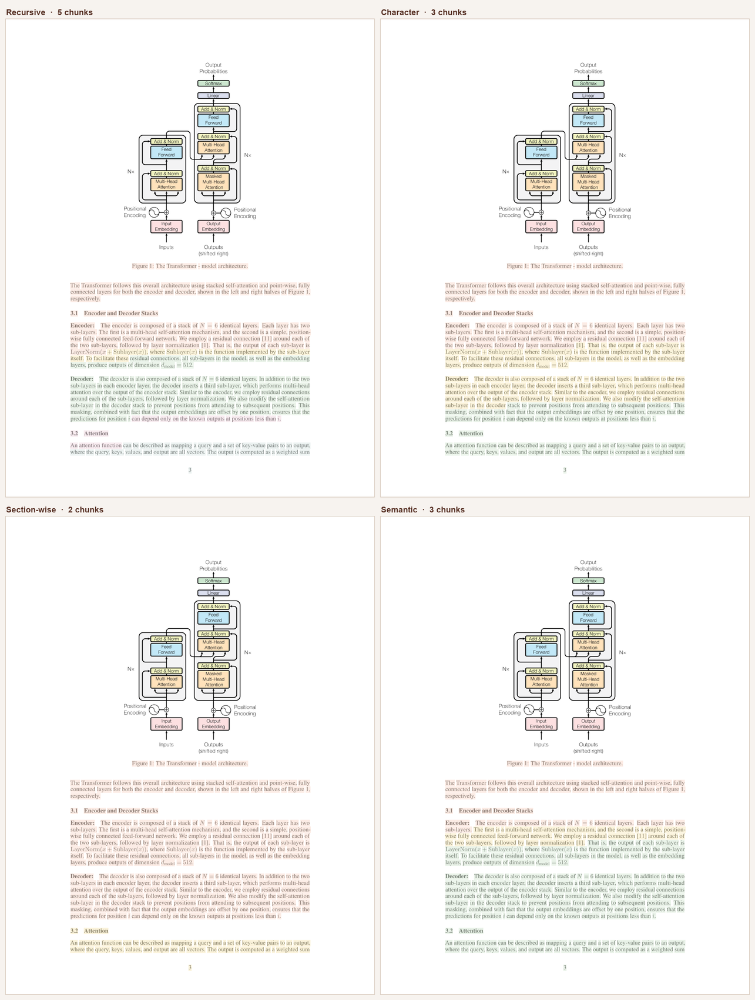

# RAG Chunking Lab

An interactive lab for the part of RAG that actually decides whether it works: **how you split the documents.**

Four chunking strategies × three vector databases × seven retrieval strategies, all measured against a golden set instead of vibes. Everything runs locally on CPU — no API key needed for the core loop.



*The same page of "Attention Is All You Need", chunked four ways. Each color is one chunk. Recursive cuts it into 5 pieces on character budget; section-wise keeps §3.1 and §3.2 intact as 2. That difference is what the retriever has to work with.*

---

## Why this exists

Most RAG tutorials hand you `RecursiveCharacterTextSplitter(chunk_size=1000)` and move on. But chunking decides what the retriever is *able* to find — a fact split across two chunks is a fact your system cannot retrieve, no matter how good your embeddings or your LLM are.

This repo makes that visible and measurable:

- **See** chunk boundaries drawn on the real PDF page
- **Measure** recall@5 and MRR for every chunker × store combination
- **Compare** dense, sparse, hybrid, and LLM-augmented retrieval on the same corpus
- **Read** [RAG_LESSONS.md](RAG_LESSONS.md) — nine concrete failures hit while building this, and what each one teaches

## Quickstart

```bash
git clone https://github.com/vineetchopra07/rag-chunking-lab.git
cd rag-chunking-lab

python3 -m venv .venv
source .venv/bin/activate
pip install -r requirements.txt

python app.py          # → http://127.0.0.1:7860
```

First run downloads the embedding model (~420MB, cached afterwards). No API keys required — every tab below works offline except the four marked ⚡.

Command line, if you prefer it:

```bash
python chunking/compare.py                              # chunkers side by side
python vectordb/compare.py                              # FAISS vs Qdrant vs Chroma
python eval/run_eval.py                                 # full 4 × 3 matrix
python eval/run_advanced_eval.py                        # retrieval strategies ⚡
python rag/pipeline.py "What is multi-head attention?"  # end-to-end
```

## What's in the UI

| Tab | What it does |
|-----|--------------|
| **Page Visualizer** | Renders a real PDF page with each chunk tinted a different color, for all 4 chunkers at once. Drag chunk size and watch boundaries move. |
| **Chunking Explorer** | One chunker at a time: chunk count, size distribution, and the actual text of every chunk. |
| **Chunking Comparison** | All 4 chunkers over the whole corpus — counts, mean/min/max size. |
| **Vector DB Comparison** | Identical chunks indexed into all 3 stores. Index latency, query latency, recall@5, MRR. |
| **Evaluation Matrix** | The full 12-way grid against 20 golden questions. |
| **Advanced Retrieval** | 7 retrieval strategies compared on one query. ⚡ for RAG Fusion, HyDE, and the rerankers. |
| **RAG Q&A** | End to end: chunk → embed → retrieve → prompt → answer, with the assembled prompt shown. ⚡ |

## Chunking strategies

All four take the same `(pages, chunk_size, chunk_overlap)` signature and return `{"text", "metadata"}` dicts, so they're drop-in swappable.

| Strategy | How it splits | Wins when | Costs |
|----------|---------------|-----------|-------|
| **Recursive** | Tries `\n\n` → `\n` → `" "` → character, backing off only when a piece exceeds the budget | You want predictable sizes and no surprises. The sane default. | Blind to meaning — will cut mid-argument if the budget says so |
| **Character** | Splits on one separator, merges up toward the budget, hard-slices anything still too long | Simplicity; bounded output with no recursion | The fixed-width fallback can cut mid-word |
| **Section-wise** | Regex-detects paper headers (Abstract, Method, Results…), joins pages per paper first so sections survive page breaks | Structured documents. Keeps an Abstract whole instead of halving it. | Only as good as the header regex — fails on documents it wasn't tuned for |
| **Semantic** | Embeds sliding 3-sentence windows, cuts where cosine similarity between neighbors drops below `mean − 1σ` | Boundaries land on genuine topic shifts, not character counts | Slow — embeds the entire corpus *during* chunking, not just at index time |

One detail worth stealing: section-wise only re-splits sections longer than `max(chunk_size * 3, 2500)`. Short sections stay whole, which is the entire point of being section-aware. Forcing every section into an 800-char budget would throw away the structure you just detected.

## Vector stores

Same interface (`add`, `search`, `count`), so the pipeline doesn't care which is underneath.

| Store | Index | Persistence | Filtering |
|-------|-------|-------------|-----------|
| **FAISS** | `IndexFlatIP` — brute force, exact, O(n) per query, perfect recall | None | None |
| **Qdrant** | HNSW graph, O(log n), ~99% recall | In-memory here; point at Docker for real persistence | Metadata filters on section/source |
| **Chroma** | HNSW via hnswlib, cosine space | Ephemeral here, `PersistentClient` available | `where` clauses |

Vectors are L2-normalized before insert, so inner product equals cosine similarity.

## Retrieval strategies

| Strategy | Mechanism | Needs a key |
|----------|-----------|-------------|
| **Dense** | Embed the query, nearest neighbors | — |
| **BM25** | TF-IDF keyword scoring via `rank_bm25` | — |
| **Hybrid** | Dense top-20 + BM25 top-20, merged with Reciprocal Rank Fusion (k=60) | — |
| **RAG Fusion** | LLM writes 4 query variants, searches with all 5, merges with RRF | OpenAI |
| **HyDE** | LLM writes a hypothetical answer passage; embed *that* instead of the question | OpenAI |
| **Reranker** | Retrieve 20 broadly, rescore with a Cohere cross-encoder, keep 5 | Cohere |
| **Hybrid + Reranker** | Both stages stacked | Cohere |

HyDE and RAG Fusion both attack the same problem: a short question and a dense paragraph don't live near each other in embedding space, even when the paragraph is the answer. One expands the query, the other fabricates a document-shaped stand-in for it.

## Evaluation

Twenty questions in [`eval/golden_set.json`](eval/golden_set.json), each with an `evidence` substring that must appear in a retrieved chunk.

- **recall@5** — did the evidence appear anywhere in the top 5? (1.0 / 0.0 per question)
- **MRR** — how high did it rank? 1.0 = first, 0.5 = second, 0.33 = third

Substring matching is deliberately crude, and [RAG_LESSONS.md §7](RAG_LESSONS.md) covers where that bites: a retriever can surface the right passage phrased differently and score a zero. Real systems need LLM-as-judge or human labels. This is a reproducible signal, not ground truth.

### Results

4 papers, 55 pages, 20 questions, `chunk_size=800`, `chunk_overlap=80`, `all-mpnet-base-v2`. Reproduce with `python eval/run_eval.py`.

| Chunker | Store | Chunks | Recall@5 | MRR | Index | Query |
|---------|-------|-------:|---------:|----:|------:|------:|
| Recursive | FAISS | 509 | 55.00% | 0.442 | 26.4 ms | 38.8 ms |
| Recursive | Qdrant | 509 | 55.00% | 0.442 | 393.7 ms | 32.4 ms |
| Recursive | Chroma | 509 | 55.00% | 0.442 | 230.3 ms | 23.9 ms |
| Character | FAISS | 321 | 70.00% | 0.560 | 3.1 ms | 27.1 ms |
| Character | Qdrant | 321 | 70.00% | 0.560 | 227.2 ms | 30.4 ms |
| Character | Chroma | 321 | 70.00% | 0.560 | 231.6 ms | 24.4 ms |
| **Section-wise** | FAISS | 275 | **75.00%** | 0.521 | 18.5 ms | 49.0 ms |
| **Section-wise** | Qdrant | 275 | **75.00%** | 0.521 | 304.5 ms | 33.0 ms |
| **Section-wise** | Chroma | 275 | **75.00%** | 0.521 | 271.7 ms | 29.1 ms |

*Semantic chunker not included — it embeds the full corpus during chunking, which exceeded the memory budget of the 8GB machine these numbers were measured on. Run it yourself from the Evaluation Matrix tab.*

**Three things this table says:**

**The vector database does not affect retrieval quality.** Recall and MRR are byte-identical across FAISS, Qdrant and Chroma for every chunker. The only thing that changes is index latency — and FAISS, the one with no server and no persistence, is the fastest at this scale. Choose a vector DB for operational reasons (filtering, hosting, multi-tenancy), not for retrieval benchmarks.

**The naive chunker beat the clever one.** Character splitting scored 70% against Recursive's 55%, using 37% fewer chunks. Recursive's strict character budget fragments passages that Character keeps whole, and a fact split across two chunks cannot be retrieved from either. More chunks is not better retrieval.

**Recall and MRR disagree, and that's the interesting part.** Section-wise has the best recall (75%) but a worse MRR than Character (0.521 vs 0.560). Its large section-sized chunks contain the evidence more often, but dilute it — the embedding averages over more text, so the right chunk ranks lower even when it is present. Optimizing for recall and optimizing for rank are not the same objective. Which one matters depends on whether a reranker sits downstream.

## Project layout

```
app.py              Gradio UI — 7 tabs
chunking/           4 strategies, uniform interface
vectordb/           FAISS / Qdrant / Chroma wrappers
retrieval/          BM25, hybrid RRF, RAG Fusion, HyDE, Cohere reranker
eval/               Golden set, metrics, matrix runners
rag/pipeline.py     End-to-end CLI pipeline
shared/             PDF loader + embedding model
papers/             4 source papers
RAG_LESSONS.md      Nine production failures and what they taught
```

## Configuration

Core features need nothing. For the ⚡ ones, create `.env`:

```bash
OPENAI_API_KEY=sk-...      # RAG Fusion, HyDE, RAG Q&A generation
COHERE_API_KEY=...         # cross-encoder reranking
```

Embeddings are `sentence-transformers/all-mpnet-base-v2` (768-dim) running locally on CPU — those stay free regardless.

## Things to try

- Drop `chunk_size` from 800 to 200 and rerun the eval. Watch recall move.
- Add your own PDFs to `papers/` and write golden questions for them.
- Ask something phrased in *your* words, not the paper's, and compare Dense against HyDE.
- Set `chunk_overlap` to 0 and find a question that breaks.

## Roadmap

- [ ] Swap substring matching for LLM-as-judge scoring
- [ ] Parent-document retrieval (embed small, return the surrounding section)
- [ ] Contextual retrieval — prepend an LLM-written summary to each chunk before embedding
- [ ] Late chunking with long-context embedding models
- [ ] Ragas metrics (faithfulness, answer relevance) on top of retrieval metrics
- [ ] Fetch papers from arXiv on first run instead of vendoring PDFs

---

Built to learn RAG properly. Every number here is reproducible with `python eval/run_eval.py`.
